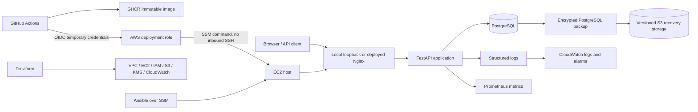

# Ops Status Board

[](https://github.com/ar7abb/ops-status-board/actions/workflows/ci.yml)
[](https://github.com/ar7abb/ops-status-board/releases/latest)
[](pyproject.toml)
[](infra/)
[](docs/integrated-cloud-audit.md)

An operator-first DevOps and CloudOps portfolio built around a small FastAPI and
PostgreSQL incident dashboard. The application is intentionally simple; the
engineering focus is the complete operational lifecycle around it: build,
test, package, deploy, secure, observe, back up, recover, troubleshoot, and
remove.

**Release:** [`v1.0.0`](https://github.com/ar7abb/ops-status-board/releases/tag/v1.0.0)

**Current state:** reproducible locally; the temporary AWS laboratory is
intentionally offline after a verified workload-first, backend-last teardown.

## What this project demonstrates

| Area | Implemented and verified |
|---|---|
| Application operations | FastAPI, PostgreSQL, SQLAlchemy, Alembic migrations, Nginx, health/readiness/version endpoints, structured request-ID logging |
| Containers | Multi-stage non-root image, Docker Compose, private database network, persistent volume, health checks, immutable image digests |
| CI/CD | GitHub Actions quality/security/container gates, GHCR publishing, protected environments, serialized releases, failed-deployment preservation, manual rollback |
| Infrastructure as code | Separate Terraform bootstrap/workload roots, versioned remote state, native state locking, plan review, drift correction, destroy/recreate proof |
| Configuration management | Reusable Ansible roles, first-run deployment, idempotence, drift correction, server hardening, systemd services and timers |
| AWS and identity | VPC, EC2, encrypted EBS/S3/KMS, IAM least privilege, SSM administration without inbound SSH, GitHub OIDC temporary credentials |
| Observability | Prometheus/Grafana locally; CloudWatch logs, custom metrics, metric filters, and disk/memory/status/HTTP 5xx alarms in AWS |
| Reliability | Scheduled PostgreSQL backups, checksums, encrypted S3 copy, isolated restore, measured recovery, controlled database incident and postmortem |
| Cost and cleanup | Explicit cost gates, tagged resources, independent post-destroy inventories, delayed billing review, documented KMS deletion waiting period |

The [evidence index](docs/evidence/README.md) maps every portfolio claim to code,
tests, runbooks, pull requests, postmortems, or releases.

## Architecture



The active local path is loopback-published FastAPI → PostgreSQL. The separate
VM and AWS deployments placed Nginx in front of FastAPI. The AWS path above was
created, tested, destroyed, recreated, operated, and finally removed. Its
configuration and sanitized evidence remain versioned; no public cloud service
is currently running.

Read the detailed [architecture](docs/architecture.md) and
[integrated cloud audit](docs/integrated-cloud-audit.md).

## Verified operational results

- **Fresh-clone acceptance:** 77 tests passed, 2 skipped, and 18 subtests
  passed; lint, formatting, Compose build/migration/health, and both Terraform
  roots also passed.
- **Dependency failure:** stopping PostgreSQL kept liveness at HTTP `200` while
  readiness safely changed to `503`; recovery returned readiness to `200` with
  persisted data intact.
- **Cloud recovery:** a checksum-verified encrypted PostgreSQL backup restored
  into an isolated target in 15 seconds during the measured lab exercise. The
  scheduled backup interval gives an approximately 24-hour RPO boundary while
  the source instance is online.
- **Reproducibility:** Terraform detected manual drift and reproduced the AWS
  workload after an approved destroy; Ansible then restored the pinned workload
  and repeated with `changed=0`.
- **Secure delivery:** a protected workflow used GitHub OIDC, a pinned image
  digest, SSM, health gates, a visible failed release, and a separate manual
  rollback to the prior healthy digest.
- **Teardown:** independent inventories found no active project compute,
  storage, network, IAM, SSM, CloudWatch, or S3 resources. Delayed Cost Explorer
  evidence was effectively USD 0.00 but still estimated, not a finalized bill.

See the [final acceptance report](docs/final-acceptance.md) for the complete
verification and limitation boundary.

## Quick local demonstration

### Prerequisites

- Git
- Docker Engine with the Docker Compose plugin
- `curl`

Clone the repository and create private local configuration:

```bash
git clone https://github.com/ar7abb/ops-status-board.git
cd ops-status-board
cp .env.example .env
cp postgres.env.example postgres.env
```

Replace every placeholder in `.env` and `postgres.env`. For Compose,
`DATABASE_URL` must use hostname `db`, and the database name, user, and password
must match the PostgreSQL file. These private files are ignored by Git.

Start the database, apply migrations, and start the application:

```bash
docker compose config --quiet
docker compose up --detach db
docker compose run --rm migrate
docker compose up --detach --wait app
```

Verify the running system:

```bash
docker compose ps
curl --fail http://127.0.0.1:8000/health/live
curl --fail http://127.0.0.1:8000/health/ready
curl --fail http://127.0.0.1:8000/version
```

Open these local interfaces:

| Interface | URL |
|---|---|
| Incident dashboard | `http://127.0.0.1:8000/` |
| Interactive API documentation | `http://127.0.0.1:8000/docs` |
| OpenAPI document | `http://127.0.0.1:8000/openapi.json` |

Stop the stack while retaining database data:

```bash
docker compose down
```

`docker compose down --volumes` deliberately deletes the local database volume.
Use it only for disposable data. The complete healthy/failure/recovery walkthrough
is in the [demo runbook](docs/demo-runbook.md).

## API and operational contracts

| Method | Path | Purpose | Authentication |
|---|---|---|---|
| `GET` | `/` | Render the incident dashboard | Public |
| `GET` | `/api/incidents` | List incidents | Public |
| `POST` | `/api/incidents` | Create a validated incident | Bearer token |
| `PUT` | `/api/incidents/{id}` | Fully replace an incident | Bearer token |
| `GET` | `/health/live` | Confirm the application process responds | Public |
| `GET` | `/health/ready` | Confirm PostgreSQL is usable | Public |
| `GET` | `/version` | Return the configured release identity | Public |
| `GET` | `/metrics` | Expose minimal Prometheus metrics | Bearer token |

Writes validate severity (`low`, `medium`, `high`, `critical`) and status
(`investigating`, `identified`, `monitoring`, `resolved`). Invalid input is
rejected before reaching PostgreSQL. Unknown incidents return `404`, invalid
payloads return `422`, and unauthorized writes return `401`.

## Security design

- Required configuration fails closed at startup.
- Secrets, credentials, real environment files, Terraform state, plans, and
  backups are excluded from Git.
- The application container runs as a non-root user with a read-only root
  filesystem, temporary `/tmp`, no privilege escalation, and dropped Linux
  capabilities.
- PostgreSQL has no host-published port; only FastAPI is published to the host's
  loopback interface. The VM and AWS deployments used Nginx as their entry point.
- Query strings, authorization headers, request bodies, and secret values are
  excluded from request logs.
- AWS administration used outbound HTTPS through Systems Manager with zero
  inbound security-group rules rather than internet-exposed SSH.
- GitHub Actions used restricted OIDC trust and short-lived AWS credentials
  rather than stored long-lived access keys.
- S3 backups used versioning, public-access blocking, TLS enforcement, and a
  customer-managed KMS key.

This was a learning laboratory, not a production compliance certification. See
the accepted findings and limitations in the
[integrated audit](docs/integrated-cloud-audit.md).

## Validation

Create a Python 3.12 virtual environment and install the locked dependencies:

```bash
python3 -m venv .venv
source .venv/bin/activate
python -m pip install --require-hashes -r requirements-dev.txt
python -m pip install --no-deps --editable .
python -m pip check
```

Run the primary local checks:

```bash
python -m pytest -q
ruff check .
ruff format --check .
git diff --check
```

Validate Terraform without contacting the removed backend:

```bash
terraform -chdir=infra/bootstrap init -backend=false
terraform -chdir=infra/bootstrap validate
terraform -chdir=infra/aws init -backend=false
terraform -chdir=infra/aws validate
```

The protected CI workflow additionally runs container smoke tests, security
scanning, Terraform validation, and CI trust checks.

## Repository map

```text
src/                    FastAPI application, models, schemas, and templates
tests/                  Unit, operational, release-safety, and integration tests
migrations/             Alembic database migrations
compose.yaml            Local application and PostgreSQL lifecycle
Dockerfile              Multi-stage non-root application image
ansible/                Server configuration and deployment roles/playbooks
infra/bootstrap/        Terraform remote-state foundation
infra/aws/              Terraform AWS workload and delivery infrastructure
.github/workflows/      CI, image publication, and protected cloud release
scripts/                State validation and cloud-release safety helpers
docs/                   Architecture, runbooks, evidence, postmortems, and defense
```

## Documentation and evidence

- [Evidence index](docs/evidence/README.md) — claims mapped to proof
- [Runbook index](docs/runbooks.md) — task-oriented operating procedures
- [Architecture](docs/architecture.md) — local, VM, and AWS boundaries
- [Cloud release runbook](docs/cloud-release-runbook.md) — OIDC/SSM digest delivery and rollback
- [Recovery runbook](docs/recovery-runbook.md) — backup validation and isolated restore
- [Database incident postmortem](docs/postmortems/m11-database-dependency-incident.md) — signal correlation and recovery
- [Cloud teardown](docs/cloud-teardown.md) — destruction order, inventory, and billing boundary

## Limitations and production evolution

The verified cloud design used one EC2 instance, one local PostgreSQL container,
public IPv4 with no inbound rules, and broad outbound HTTPS. It proves automation,
identity, observability, recovery, and operations—not high availability or
production scale.

A production evolution would add multiple availability zones, load balancing,
autoscaling, a managed multi-AZ database, private subnets and VPC endpoints,
centralized secret rotation, notification/on-call routing, larger load and
recovery tests, and stronger environment isolation.

Optional production improvements are listed above; they are intentionally
outside the completed `v1.0.0` laboratory scope.

## Release history

| Release | Scope |
|---|---|
| `v0.1` | Application, database, API, health, and logging foundations |
| `v0.2` | Containers, CI, scanning, and immutable image publishing |
| `v0.3.0` | Manual VM operations, Ansible, local monitoring, backup, and recovery |
| `v0.4` | Terraform/AWS creation, SSM deployment, drift, destroy, and recreation |
| `v0.5` | CloudWatch and protected OIDC/SSM delivery with failure and rollback |
| `v0.9` | Encrypted restore, incident response, integrated audit, and teardown checkpoint |
| [`v1.0.0`](https://github.com/ar7abb/ops-status-board/releases/tag/v1.0.0) | Demonstration, clean-clone acceptance, evidence package, and final portfolio acceptance |

The historical cloud checkpoints preserve what was verified before teardown;
the repository’s current status remains intentionally offline and cost-bounded.
